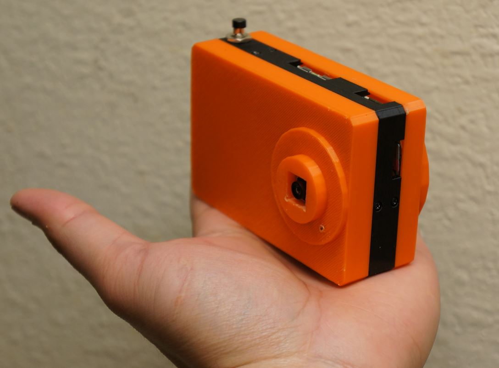
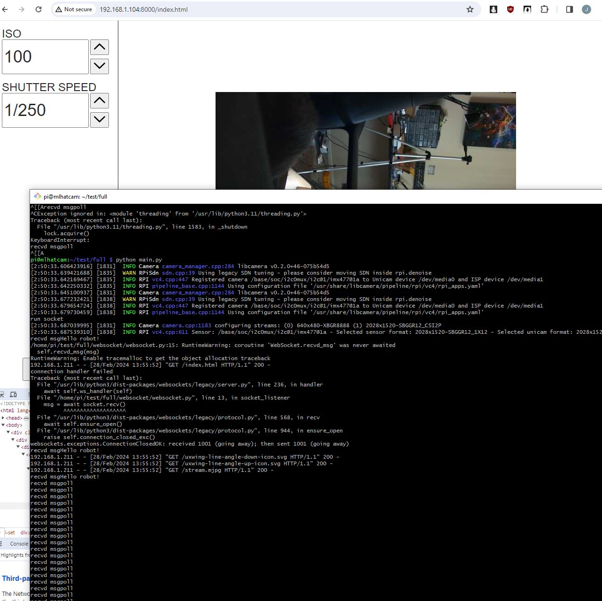
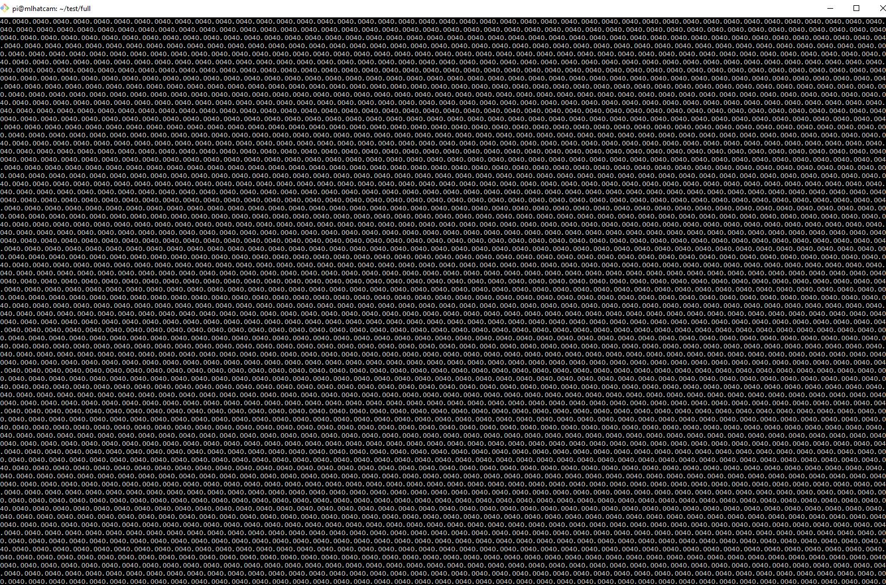

03/04/2024

Okay... I'm gonna experiment with this camera's software settings

I want to be able to take good photos/not have bad autofocus choices

Mostly landscapea looking far way, I think I will need the phone to do macro

Oh nice, 0 for manual, the other thing I have to look into is auto rectifying (distorted lines)

11:58 AM

I find myself trying to rationalize why the images are not great

The answer is simple... it's not a real camera eg. 4/3, fullframe, etc... or a modern phone

Also any kind of motion is not good with the automatic settings

12:01 PM

I am unfortunately starting to lose interest in this project, just because the reality of my life (I'm f'd/in poverty) is weighing down on me

So... I have to start grinding on something that actually makes money since my applications are getting rejected or ignored

It's my own fault really... I've been quite lucky with the jobs I've had... I just forgot about my debt for some reason and how all my life I've been poor

12:18 PM

It's interesting... far away stuff looks worse than close (sharpness)

12:24 PM

Damn... I can't help but feel disappointed lol... after all this time... ugh IT'S NOT A REAL CAMERA Jacob

12:26 PM

I have t leave again for a plasma donation... today the sun poked out could have been good

I think I will try it anyway without a video/solid software

I just want to see what it looks like outside

The problem is vibration... idk I guess I'll take many shots

But it is a small enough camera where I can just stick it in my hoodie pocket

I'm tempted to get the standard to compare but idk if it's worth it

12:32 PM

Ha it's that thing... sunk cost

12:35 PM

Yeah... I'm gonna have to dump more time into this

12:42 PM

The cool thing is... with the focus you can switch between far and macro in theory

12:47 PM

I know what I can do... I will make the wifi mjpeg_server interface with focus set and take photo... then I can dial it down in real time

12:49 PM

FUHHHHHHH I'll get the standard angle so I can personally compare them

It's $25 anyway

The main reason is with regard to landscape... I want to see if it's not as bad with distortion since it's not so extreme with regard to angle

28mm sounds good too, I used to use 35mm quite often

It is done... $40 lol... that's currently 2.3 hrs of my life, used to be less than 1

Alright so yeah... I'll go out today, and then work on the wifi focusing stuff to get it down/understand this camera more

Ahh man... this camera is not easily detachable though... I need a mechanical pin join thing which does exist but they're still two flip tabs... it's not like a slide/click deal

I am thinking about another hat cam project that's simpler/you clip it to the front of your hat

It has as touch screen interface (maybe the round one I already have) so I may end up re-using these cameras for that idk

---

03/03/2024

4:40 PM

Finally... I'm free! PTO too my pitiful $17.50/hr current value for existing

Before I fall into a coma from my weekend food binging let me design the front plate and print it, I have like 6 hours left today to print stuff

5:00 PM

Okay so the top of the v3 module camera is opposite of where the flat cable comes in

The test shot I took wow, everything is clear... I'm really liking what I'm seeing so far

The test will be to take it outside tomorrow

6:10 PM

It's printing now, hope it's right lol

11:51 PM

I christen thee... orange slab

---

02/28/2024

10:39 AM

Back on

yesterday I did succeed in getting some form of mobile to pi bridge eg. the AP method vs. bluetooth

I have started to see a basic interface, based around the mjpeg_server.py sample code (live stream of camera)

That is a pro over bluetooth/BLE

These are the goals right now

- [x] get pretty AP url to connect to
  - needs hostname changes use qr code generation instead
- [x] serve mjpeg_server.py with custom html and websocket control
- [ ] build ui
- [ ] integrate into existing camera software
- [ ] qr code generation

Yeah something like this

Side note, I think I will eventually make a separate repo of the camera software

Since the pi zero hq cam and this one use similar code

I was trying to come up with names lmao

This one was like "pi cam firmware" but doesn't make sense, it's not firmware

Too many syllables too for the name

11:00 AM

Ahhhh so annoying once you enter AP mode you can't get out have to turn the RPi off/on until I write the code to self toggle.

11:04 AM

oh... the most foolproof way would be to generate a QR code then it doesn't need a hostname

Show it on the screen... maybe it's not good enough to scan

change hostname

- edit /etc/hostname
- edit /etc/hosts

This sucks, more steps for user

Yeah this works though

Okay anyway gotta go for MVP, video out today... got like 4.5 hours before I gotta donate plasma for cash because I'm poor and a dumbass (to become poor)

so now I'll take apart the mjpeg_server.py example and modify it, add more to it then it's already in class form so it should be straightforward to add it to existing camera code

11:24 AM

Ugh... more code nastiness... so the mjpeg_server.py hosts its own html file which I'm expanding upon... it's just nasty because it's not serving static files, it's injecting them as plaintext

11:27 AM

The good news is the code can be developed separately/opened on its own, when python runs it injects all the files together with the stream

Still don't have the websocket and dynamic camera settings

Update this

11:38 AM

The other thing I have to verify is the websocket working, the issue is the ip/hostname with the AP mode

I'm hoping localhost just works

11:44 AM

Oh yeah I should do an overlay on the video for the current values

12:29 PM

So right now I have a working socket, no video stream

trying to run nested threads doesn't work I guess

It sucks because by having classes it was cleaner, but the code also doesn't work... ha

12:33 PM

Okay this is all working now... the camera will just have to be coordinated when it is being used

Damn haven't heard Waax in a min

12:42 PM

I'm losing momentum dang

Doubt I'll be able to integrate this into the camera software, just demo it working from SSH call

12:46 PM

Look at that... learning about photography by programming the UI of one ha

Shutter speed in this case and how picamera2 uses thes values (microseconds) vs. fraction of seconds (camera brands)

1:02 PM

Right now I'm not sure of all the values to modify on the camera for manual shooting

No electronic aperture so can't set that

Have under 2.5 hours left till I gotta go do the donation

The camera is not dynamic yet, need to read up briefly on how to set that

1:20 PM

I have to make sure this works with localhost so ip does not need to be known

1:34 PM

Gonna integrate the web ui into the camera stream now

1:55 PM

OMG... I figured out how to modify this server to host images too... files later I imagine damn

Here you can see the livestream and the styled interface with websocket, it's not bridged to the picamer2 yet but not bad

I'm developing against the ml-hat-cam (pi 4b) since it's powered by usb

2:23 PM

Ahh damn... it's that stale variable thing

picam2 is None when it's set due to the method bind damn

2:24 PM

Wait a minute, wait a minute (chess scene Independence Day)

2:26 PM

okay I have it working but the values aren't right

lmao wtf is this

Seems to be from the await

2:37 PM

Ugh... this ISO to AnalogueGain thing is whack

looks like 1-16 maybe, verify with metadata

Damn it can go to 100 wtf...

2:49 PM

I need to test this against the v2 module

2:57 PM

Dang... bout to be out of time

Will be gone for like 2 hours

3:14 PM

Yeah right now the shutter does not work, causes a problem so I have to look into that

ISO is working though

---

02/27/2024

6:46 PM

ugh... I started around 10 AM and I have NOTHING!!! to show for lmao, tragic

Now doing the AP route for the mobile control of the Pi Camera

I had to reflash the ml-hat-cam (pi 4) board with bookworm so it has network manager as the default internet access vs. dhcpd

Was dumb like "so if I switch this to networkmanager I lose connection right?" yes...

installing picamera2 right now... weird this "external" error

I'm going to have to redo the modular pi cam's sd card as well ugh... also using bullseye

7:15 PM

Okay I was able to get a hotspot going and run the node app

It looks like it will be a flask app (python server) so everything's "homogenous"

https://www.raspberrypi.com/tutorials/host-a-hotel-wifi-hotspot/

This looks good since I want a pretty url to go to

Damn... wasted a day sucks

I'll probably do some variant/combination of the mjpeg_server.py output with controls on the sides/overlaid if too small

7:21 PM

While I do regret dumping so much time into the bluetooth approach, this AP way may be better anyways just because of the data throughput

I can do livestream video for example, I will test that actually just to be sure

7:38 PM

I'll continue with this tomorrow... might be time to make an actual separate pi camera repo

I'm just not a good code setter/trailblazer since I don't have any good practices/not a good architect

8:01 PM

Ugh... bookworm why... pip install now uses apt python3-pkgname

- install git
- sudo apt install python3-numpy
- sudo raspi-config (interface options, enable spi)
- sudo apt install python3-pillow
- sudo apt install python3-picamera2

This is so sus man the python3-pillow for example

8:13 PM

oh man... back to same state as before, working pi camera
