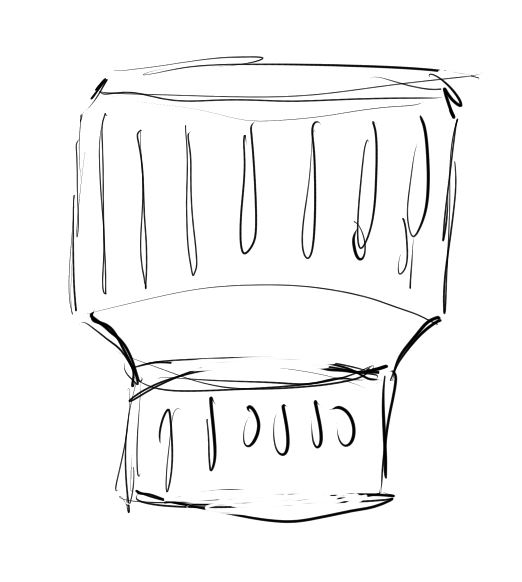

### 03/26/2024

10:55 AM

Slept in again, resetting my 2015 i7 mbp after moving its files to the carbon x1 gen 6

Gonna do some quick 3D print related stuff, touch up the focus ring lens and print some caps for the v3 modules so I don't feel so bad throwing them in my backpack

11:09 AM

So I'm gonna dump the values from the camera read and map them... ideally this process would be dynamic

It can be useful for Arducam support for example, I'm talking about getting the max resolution

11:13 AM

Yeah I can't dump too much time into this project right now.

I want to start working on the ESP32 LCD for the ml clip cam

this looks like a good link one day when I really get down to quality

https://github.com/raspberrypi/picamera2/discussions/157

11:21 AM

I guess I already fixed the lens

11:27 AM

Why kill the fever, whatever happened to sweat?

Damn I remember listening to this song while mowing a lawn like 16 years ago

11:38 AM

Hmm... seems calling this libcamera and running picamera2 at the same time causes problems so I had to reorder the code

11:41 AM

As I write this code I'm worried about not being able to pay my bills so I'm not really thinking about writing good code, I want to get it done, have a temporary distraction from my reality and then get back to my reality

---

### 03/25/2024

Distracted

I'm thinking about how I have to make money/freelance but I'm working on this

11:17 AM

Starting to write code, I slept in today, I got up after 10:00 AM

Gotta donate plasma in 6 hours ugh... oh well that's near end of day and need the cash

Ugh... I have too many of these pi cameras, have to remeber which is the ip

I could set the hostname ehh

182 is pz hq cam, modular pi cam is charging, I did a battery profile on it over night

11:25 AM

This can work, `libcamera-hello --list-cameras`

https://forums.raspberrypi.com/viewtopic.php?t=325259

Wish it was cleaner the output

This will work, I need a way to set the camera dimensions/crop max boundaries

11:40 AM

I feel kinda stuck here waiting for the camera to charge, I want to write the code against it

I have the pi zero hq cam but that has its own code already, camera can't change

12:53 PM

Ugh... I am dumb to keep using SketchUp it's like a simple task takes 30 minutes vs. 1 minute eg. extrude a hole through something, it f's up a bunch of surfaces I have to fix to have a continuous mesh

I designed and started printing the aperture ring for the 16mm, I'm doing the front focus ring now which is more complex/includes a front flat face

12:58 PM

I did not go fancy on the wrapper, it does have sunken grips vs. extruded

1:03 PM

I am feeling down today, kinda just working through it

Might have to do the refactor tomorrow since I'm spent now

It's only been like 3 hours since I got up but spending most of my time designing this lens wrapper... ehh

I need a lens cap too but that is simpler to design

3:14 PM

looks like the v3 camera modules use less power than hq cam hmm... life time is 8 hrs

3:23 PM

Oh man I like how this lens wrapper feels... it's slippery but pleasant lol

9:49 PM

The whole lens wrapper and cap is printed for 16mm

I need to design/print some caps for the v3 modules

### 03/24/2024

5:12 PM

My weekend has finally started and I'm fighting this headache feeling/want to pass out

Going to design/probably start printing the lens wrapper rings around the 16mm

5:52 PM

Damn I'm struggling

I want to go for a flared out look and inverted grip lines plus a bevelled front

Something like this

Ugh... can't... tomorrow, like the code refactor

---

### 03/23/2024

9:43 PM

Gonna put some time into the zoom

Tomorrow I'll design and print the lens wrappers for the 16mm lens

It does suck that the design is lazy, it won't have visible f-stop numbers

I did have a thought about putting an RFID thing or some ID on the lenses so when they get attached to the RPi you know which one was used

9:46 PM

Damn... I'm looking at this code that I wrote and I don't remember how it works lmao

1014 what is this number, 4056x3040 / 4

I need a picture, I'll have to do this on Monday morning

Other issue is it has to be based on the camera's resolution too when they swap

10:02 PM

Man... I soldered the switch in the wrong place on the modular pi cam v2 as well like ml clip cam... seems I carried this mistake around... so dumb I didn't do it on the other two cameras

The switch is in the wrong spot so it doesn't completely turn it off, the BMS still runs, quiescent current, also turns on camera when charging

not great

10:10 PM

No... it's soldered right, that's weird

Switch is between battery and BMS input... but the charger outputs power while charging... how is the Pi Zero HQ cam not turning on while charging... hmm

it is wrong, okay... the BMS is supposed to cut power to the rest of the system so it does not use a physical switch, uses internal chip yeah

---

### 03/20/2024

11:47 AM

I want to use this camera... it has no software on it... so I'll throw something together based on Pi Zero HQ Cam's code... which is not good code, I keep having to restart it at the field

I just want to use this camera outside

I will add a start up camera detection thing which will then add the ability to change the aperture by pushing up/down on live preview with the overlay

I'll also add the overlay in MP based on camera

11:57 AM

Oh dang... right the LCD drivers are different

Those will need wrappers

12:25 PM

Brief break

Also thought about how the LCD dimensions out to be from outside in if the icons are near the edges of the screen

12:44 PM

Distracted

- [ ] swap display library, update resolution
- [ ] try a blind run

1:44 PM

Distracted

Still trying to get the display running

I'm waiting for a UPS package that may or may not get delivered to me sucks, apt complex life

I gotta sell more plasma later, thankfully arm has low bruising, been icing that boy

