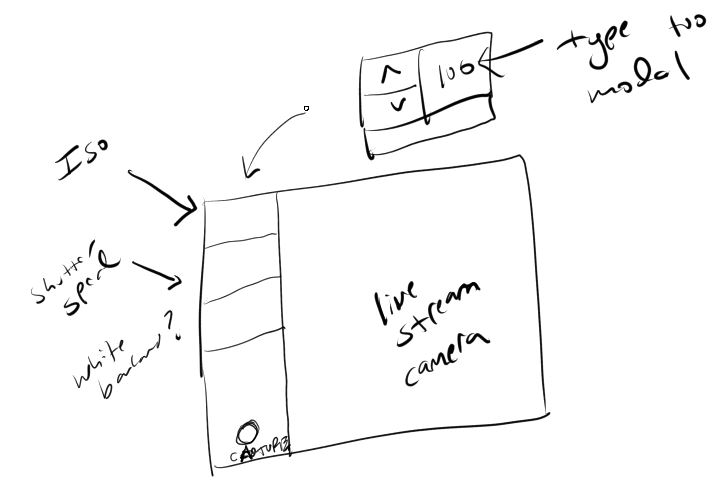
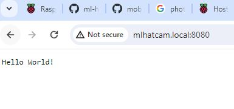

02/28/2024

10:39 AM

Back on

yesterday I did succeed in getting some form of mobile to pi bridge eg. the AP method vs. bluetooth

I have started to see a basic interface, based around the mjpeg_server.py sample code (live stream of camera)

That is a pro over bluetooth/BLE

These are the goals right now

- [ ] get pretty AP url to connect to
- [ ] serve mjpeg_server.py with custom html and websocket control
- [ ] integrate into existing camera software

Yeah something like this

Side note, I think I will eventually make a separate repo of the camera software

Since the pi zero hq cam and this one use similar code

I was trying to come up with names lmao

This one was like "pi cam firmware" but doesn't make sense, it's not firmware

Too many syllables too for the name

11:00 AM

Ahhhh so annoying once you enter AP mode you can't get out have to turn the RPi off/on until I write the code to self toggle.

11:04 AM

oh... the most foolproof way would be to generate a QR code then it doesn't need a hostname

Show it on the screen... maybe it's not good enough to scan

change hostname

- edit /etc/hostname
- edit /etc/hosts

This sucks, more steps for user

Yeah this works though

Okay anyway gotta go for MVP, video out today... got like 4.5 hours before I gotta donate plasma for cash because I'm poor and a dumbass (to become poor)

so now I'll take apart the mjpeg_server.py example and modify it, add more to it then it's already in class form so it should be straightforward to add it to existing camera code

11:24 AM

Ugh... more code nastiness... so the mjpeg_server.py hosts its own html file which I'm expanding upon... it's just nasty because it's not serving static files, it's injecting them as plaintext

11:27 AM

The good news is the code can be developed separately/opened on its own, when python runs it injects all the files together with the stream

Still don't have the websocket and dynamic camera settings

Update this

11:38 AM

The other thing I have to verify is the websocket working, the issue is the ip/hostname with the AP mode

I'm hoping localhost just works

11:44 AM

Oh yeah I should do an overlay on the video for the current values

---

02/27/2024

6:46 PM

ugh... I started around 10 AM and I have NOTHING!!! to show for lmao, tragic

Now doing the AP route for the mobile control of the Pi Camera

I had to reflash the ml-hat-cam (pi 4) board with bookworm so it has network manager as the default internet access vs. dhcpd

Was dumb like "so if I switch this to networkmanager I lose connection right?" yes...

installing picamera2 right now... weird this "external" error

I'm going to have to redo the modular pi cam's sd card as well ugh... also using bullseye

7:15 PM

Okay I was able to get a hotspot going and run the node app

It looks like it will be a flask app (python server) so everything's "homogenous"

https://www.raspberrypi.com/tutorials/host-a-hotel-wifi-hotspot/

This looks good since I want a pretty url to go to

Damn... wasted a day sucks

I'll probably do some variant/combination of the mjpeg_server.py output with controls on the sides/overlaid if too small

7:21 PM

While I do regret dumping so much time into the bluetooth approach, this AP way may be better anyways just because of the data throughput

I can do livestream video for example, I will test that actually just to be sure

7:38 PM

I'll continue with this tomorrow... might be time to make an actual separate pi camera repo

I'm just not a good code setter/trailblazer since I don't have any good practices/not a good architect

8:01 PM

Ugh... bookworm why... pip install now uses apt python3-pkgname

- install git
- sudo apt install python3-numpy
- sudo raspi-config (interface options, enable spi)
- sudo apt install python3-pillow
- sudo apt install python3-picamera2

This is so sus man the python3-pillow for example

8:13 PM

oh man... back to same state as before, working pi camera
