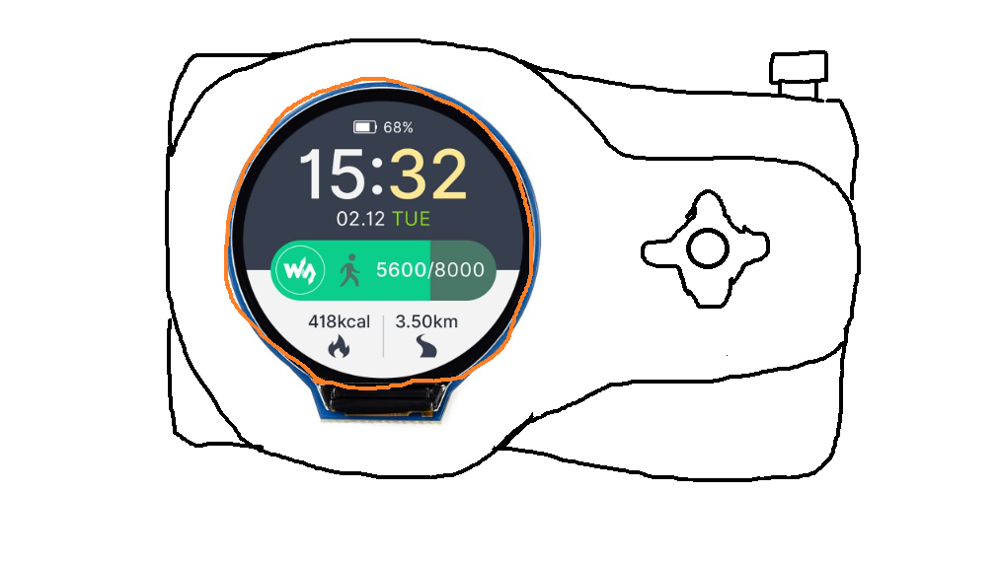
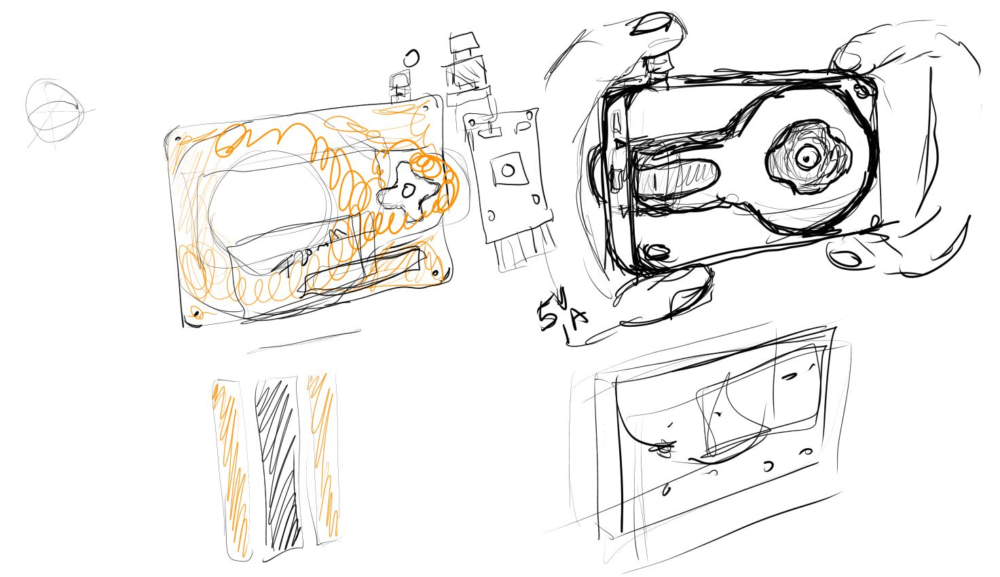

02/19/2024

4:10 PM

I just got the parts, I'm really gushing over the touch screen demo that comes with the 1.28" ESP waveshare display

4:37 PM

As of right now the design is not solidified yet, it will help to make the physical part models/arrange them but I have a vague idea from this old drawing.

After trying the touch screen round display I'm really impressed wow... like I want to make a watch project or something... I'm not a watch person though

4:53 PM

So this is the design I'm going with roughly

5:39 PM

While modeling the LCD screen, I decided I'm not going to screw it down rather use glue, not on the weak parts, the wires and part of the PCB.

It's not touch so this won't get much pressure applied to it anyway.

Otherwise it will use compression fit to fit into the body
