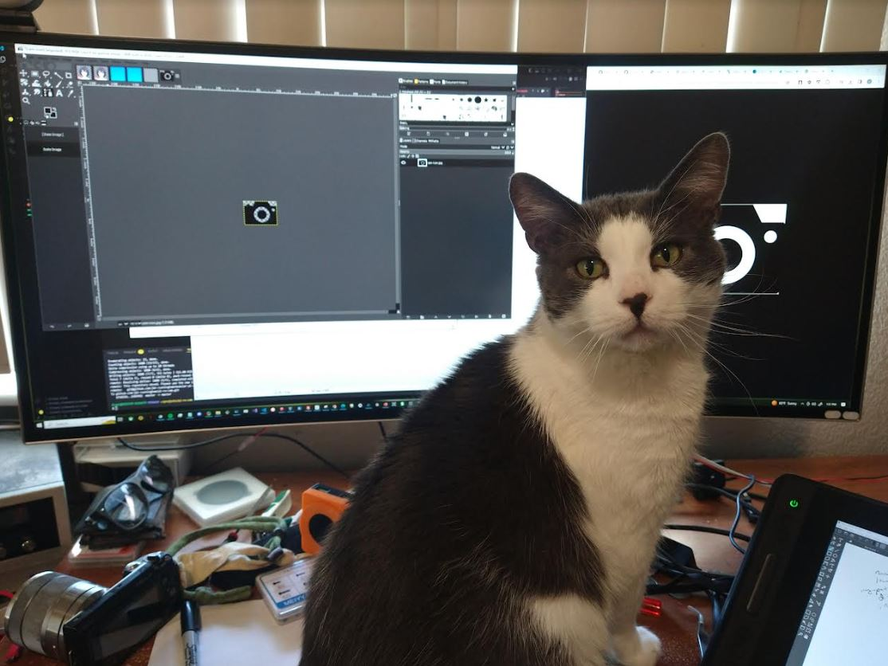
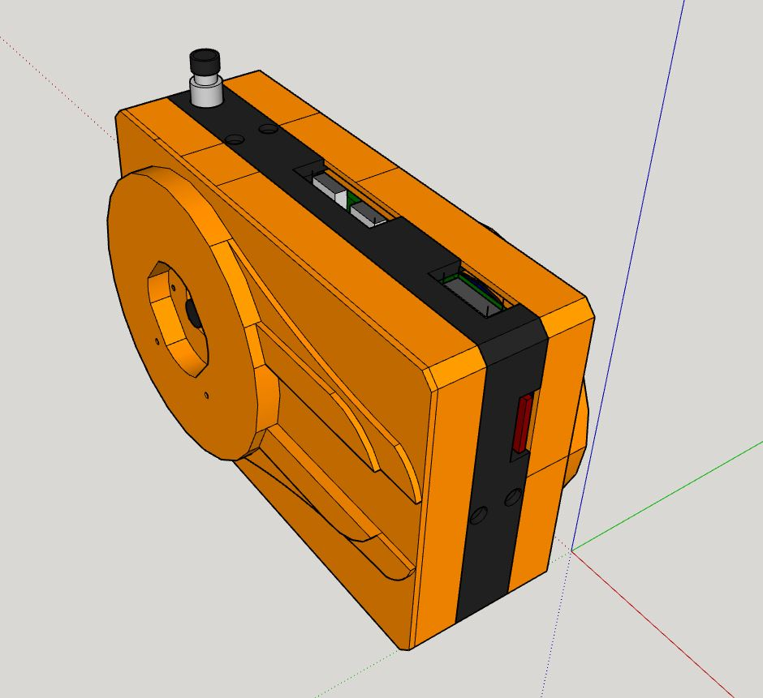
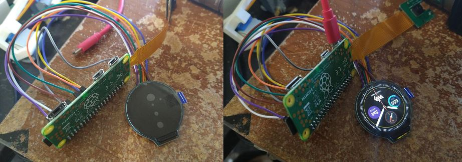
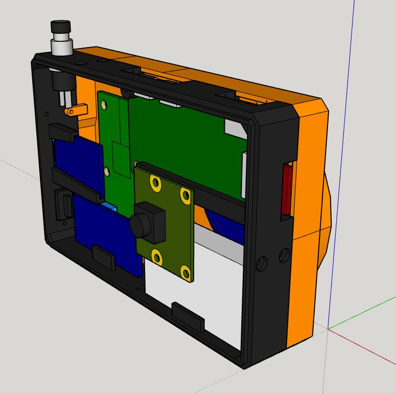
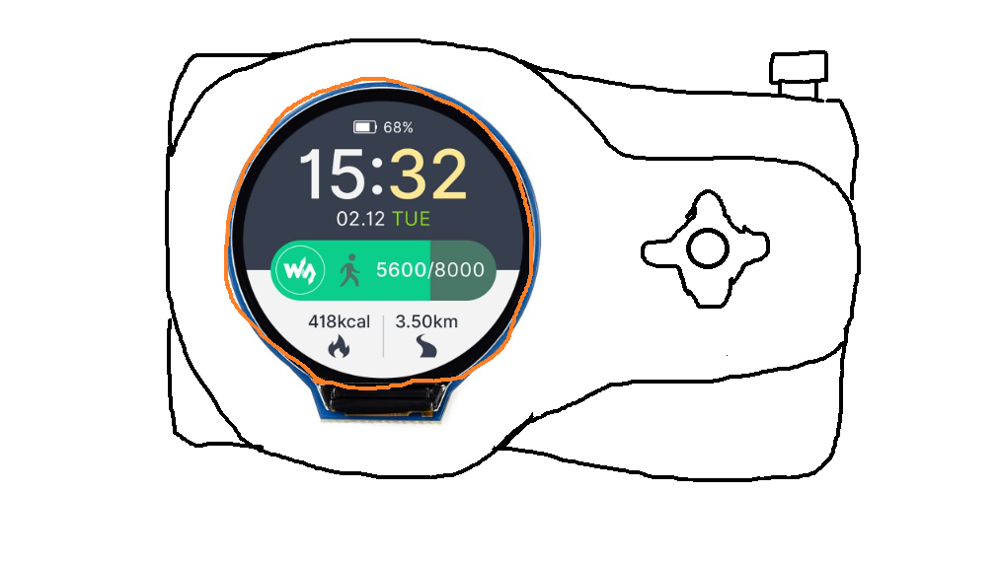
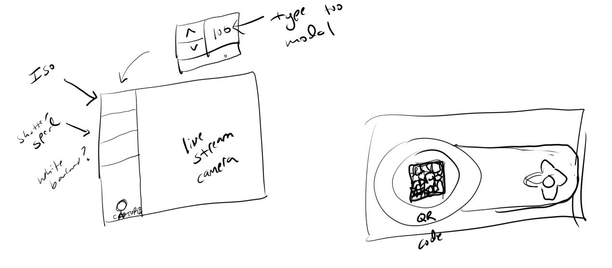
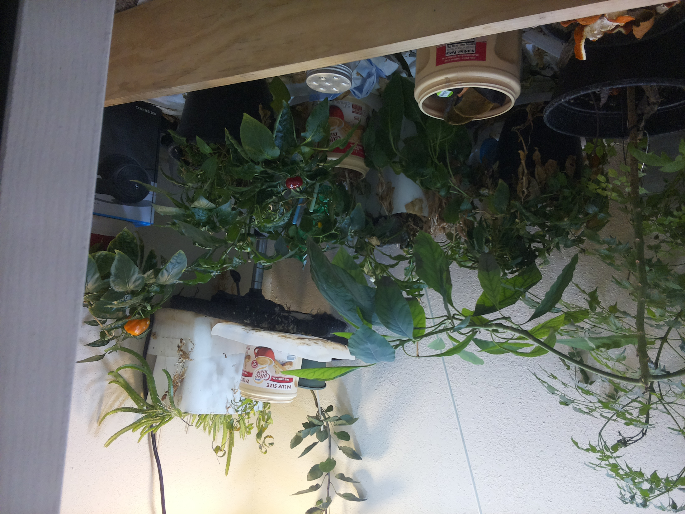

02/22/2024

Damn... cool company rejected me sad... I spent 2 hours on their CTF challenge just to apply lmao

11:32 AM

Alright let me write some code for this camera, last day off

I started the front-plate print already

12:41 PM

Distracted with repositioning the LCD and updating design files, back to code

1:29 PM

Main thing need to accomplish today is a functional menu/able to take photos

- [ ] basic menu
  - [ ] three options
    - [ ] files
    - [ ] camera
    - [ ] settings
- [ ] camera live preview
- [ ] take photo

1:34 PM

For some reason the menu I see in my mind is blue-ish... like Windows 7, aero style... so I'll try it

Need a light blue gradient background

I've also started to see a menu schema in my mind like

```
[
  {
    "name": "battery icon",
    "img_path": "../path/path",
    "size": [30, 50],
    "position": [15, 15],
    "interactive": true,
    "callback": "fcn"
  }
]
```

Then the menu would go through the list of icons and apply them to the layer before drawing the whole thing on screen

1:53 PM

Got this distraction in the way



2:08 PM

Alright let's go... focus mode

2:35 PM

Dang camera died gotta wait to run code on it, still a lot of code prep to do but yeah

I saw a value of 40MHz or something like that for SPI value I'm hoping it is actually fast, maybe it's limited to the 20 something MHz of Pi Zero 2, I'm probably wrong on that

2:38 PM

I do feel myself losing momentum though, reality on the mind and losing the vision/excitement of this project

Happens with a lot of my projects I just lose interest in them

2:40 PM

Quick break

3:59 PM

It's assembled at this point, drew first menu scene, still need lots of code

Also need to provide the cliche MS paint wiring diagram and pins

5:06 PM

Damn... I'm not sure how much further I'll get today... I should be able to make the basic program/control loop to cycle through the menu/enter camera mode (needs live pass through) then take a photo.

5:23 PM

Oh man I'm spent, headache, gotta get that ver 0.0.1 out ha

---

02/21/2024

10:34 AM

Poor sleep but got up decent, had to do a house cleaning chore but back on

I'm going to start with soldering the electronics inside the middle layer

I want to print the back plate but I'll make sure the middle one is good before I switch filament colors

2:31 PM

Oh man that took me a while... longer than I thought, about 3 hours to solder everything

Going to write some test code now to verify everything is soldered up

So funny my cat sheds so I see a random white hair floating by and I think it's the hardware smoking

Since I'm making a new camera software with some main concepts borrowed from the other camera... starting to wonder if it's worth writing dedicated code... for custom cameras

I'm a bad pattern setter though with regard to best practices

3:07 PM

Ugh... idk if my 5D rocker joystick is defective or what... when you click the middle it clicks other buttons

I have some work arounds just sucks..

I cna do a debouncer since it fires multiple things vs. just one, the other directions are reliable

I can also alternatively use the shutter button as a menu selector

Ehh... idk

3:21 PM

Ehh... this sucks

I might just go with the shutter button, the debouncer is not great

3:23 PM

I have to go do this appointment thing (donate plasma for money) then pick up the v2 cam module

I should have the back plate done soon, hopefully everything fits

I'll modify the front plate design when I come back and print it tomorrow

Tonight I'll work on the software

7:39 PM

Got back like 30 mins ago, was putting black tape around the LCD since it has a gap... also it would need redesign to have a smaller diameter so the black ring around the LCD is under it

Working on front plate design right now

8:01 PM

Ugh... it's unfortunate how much empty space there will be with this front plate, it's mostly the height for the camera. The front of the design has it countersunk so that removes depth.

I also flipped the circles around ugh... supposed to be matching like back blate circle is on left side (around display) front plate would have it on right... oh well

If the camera cable is longer can have it on same side

9:22 PM

Man... I don't like how it looks now, it was thin before



The thinness made it cool somehow, not so blocky/basic

idk... modular right... make a new one with the v3 camera module

9:47 PM

I'm pretty spent now, I won't be able to program but I can do some menu design.

I'll write the code for this camera tomorrow, I have been seeing a round menu in my mind

---

02/20/2024

11:04 AM

Ehh... I think I went to sleep between 1:30 and 3 AM not sure

Not great but here we are, got things to do

I want to get the middle section done today, that means all the electronics are mostly wired

I don't like the idea of soldering to a pi... so I will use a male header pin to female header with daughter board... question is just how much space/how big is the middle section or is that part of the front/back plate... means have to split up the female header

Let me solder a new pi zero 2 real quick since I'm going to swap the pi zero 1

11:09 AM

At some point I may make a full size RPi so that's why I'm having a pi zero folder

11:52 AM

Alright done soldering

I'm working on a full/long video as I make this so that takes up my time too, I want to get the audio in sync right away (rode)

Now I gotta find this new pi's ip arp-scan that ho

12:01 PM

Man... took me a bit to find the new ip, only place I have arp-scan working on is my 2015 i7 MBP that massive laptop

Anyway I'm working on just getting an image to show up on the round display with the sample library code right now

Then I'll go back to modeling to start building out the dimensions

Also I know the edges of the middle piece will be a standard for back/front face plates to follow, it will have a step-seal design that helps with keeping it together other than the screws

12:06 PM

I'm concerned swapping sd cards from pi zero 1 (older install) to pi zero 2 may be problematic... but I also don't want to start from scratch idk... now is the time

I'll do it

I'm gonna use a better card too

Ugh... gotta deal with that supplicant crap but the imager has it

Ehhhhhhh 128GB seems overkill for storage idk...

Why not... why not... future proof

Yeah... I think I'll pick up the v2 camera tomorrow from the locker when I have to go out too, then I won't have that mini distraction driving there... I have a v2 module on hand for dimensions although it's on that navigation project, I also have a model of it already

I won't print that piece today though, can work on back tomorrow

OMG... I have to arp-scan again...

12:19 PM

Alright new OS is loaded 64-bit lite

OMG that speed... yes

12:27 PM

distracted, potential job looked at my LI profile, don't get your hopes up boy

gotta add git

12:32 PM

it's all about mentality man, the world is open

Alright gonna do some dev on the pi itself

yoooooo it's bright as hell damn!

Learned that the top non-circular bit is the top



12:39 PM

Doing part/body modeling now

1:16 PM

Making a conscious decision for the SD card to not be accessible since there's no need... and even if you need to, just unscrew four phillips screws

ehh.... idk I have a very short camera cable is the thing but it's long enough

1:55 PM

Hmm... it's a tad small 4" longest dimension

Right now the middle piece is 1" wide, not sure if that's enough or not

It's relying on some of the volume being provided by the face plate

I just gotta design the screw holes, outer edges then can start printing soon

Quick break

2:35 PM

back on

4:25 PM

starting to print...

regarding the menu, I was thinking of using circular icons to fit the round display

then I do want to try an animation as you hit left/right and it enlarges the focused circle

4:29 PM

Well... while that prints guess I'll start working on the back plate then for the display and 5D joystick

It's possible I made the design a little too small where it'll be hard to solder wires... use smaller wires I guess

5:03 PM

oh god it's ugly lmao

6:01 PM

After a certain size project you start fighting sketchup because it starts to lag like 5 second delay ugh after a click

7:55 PM

Ooh that looks good



Front is just the camera with a custom design not bad

8:36 PM

Design is going well, almost done, doing food break

Won't be able to print anymore but I can start printing tomorrow morning

---

02/19/2024

4:10 PM

I just got the parts, I'm really gushing over the touch screen demo that comes with the 1.28" ESP waveshare display

4:37 PM

As of right now the design is not solidified yet, it will help to make the physical part models/arrange them but I have a vague idea from this old drawing.



After trying the touch screen round display I'm really impressed wow... like I want to make a watch project or something... I'm not a watch person though

4:53 PM

So this is the design I'm going with roughly



5:39 PM

While modeling the LCD screen, I decided I'm not going to screw it down rather use glue, not on the weak parts, the wires and part of the PCB.

It's not touch so this won't get much pressure applied to it anyway.

Otherwise it will use compression fit to fit into the body

5:41 PM

Today I'll definitely get the LCD turned on, I may even keep the pins as is/male header vs. soldering custom board.

I could see it working... the pins use the 3.3V pin of the pi/with resistor to feed the control board, then into the GPIO pins... reduces parts

6:07 PM

Oh man... I can't accept that the photos will be bad... if you were to actually use this camera

Maybe I will upgrade it to the 12 MP v3 camera... same dimensions roughly as v2 looks like

What's funny is I probably won't use this camera anyway after it's built

6:13 PM

Ugh... yeah... I gotta get the wide angle one damn... that will delay parts but I will just make the part where the camera sticks through big so it can fit/I can work with the 8MP in the mean time

What's annoying is I can't buy it from Amazon, I keep finding Arducams

I'm also trying to decide wide angle or short angle... but it won't be useful as a video camera since no audio/pi zero 1

Ugh... will I actually take this to park... idk

It's worth it though

Lol... I can drive to my microcenter and get one

They don't have the wide though just normal... I mostly shoot landscape so it has to be wide

Let me see if I can afford it too ugh... I wish I didn't buy the v2... I can use it for something else

6:24 PM

Other thing that sucks, touch screen can be useful for drag/drop/point zooming vs. physical button

Ahh... I'm taking a risk with this Arducam but I suppose I have used one before the ML Hat Cam's camera was arducam

Hmm... I actually may not be able to buy this right now lmao... I can just design different face plates that hold the camera sizes...

Which means... I can actualy wait and buy a name-brand Rpi module 3 camera

6:54 PM

We're back on... I'll just order that in the future, upgrade face plate sort of thing, I could make the front have an inner interchangeable piece but I want a whole usable thing by end of these 4 days off today is 1st day

6:56 PM

I want to be able to start printing as early as sometime tomorrow, rushing is bad with printing but yeah it takes so long...

break

7:28 PM

Trying to fire up this display but the wires they sent are backwards damn...

I'm gonna have to make an intermediary board just because of how long these display wires are

7:42 PM

I wonder... I have a pi zero 2s right now... should I just use it... need to solder pins

Ehh... future problems can swap same form factor at least, just more soldering

7:50 PM

Oh yeah I'll have to have a function that crops images before display

I'm not really gonna make huge progress tonight, distracted but tomorrow will be productive

I'm gonna keep modeling/designing to get a rough idea of what I'll try to build

I think the main point though is the center piece holds almost everything and then the back/front plates can be changed long as they can still screw into the middle piece.

7:53 PM

Lol I'm waiting for the pi zero 1 to upgrade

The thing is... this camera isn't really doing anything so I'm not trying to stuff a Pi Zero 2 in it if it doesn't need it... even with the camera module 3 I think the zero 1 can handle it

7:57 PM

I think what I'll do is prototype all the stuff that's unknown like snap connectors while I have the black filament loaded... it's not a huge deal to switch but yeah

8:01 PM

It's so funny I'm like "what does the 8MP camera sample look like?" well I have one on the "floating navigation sensor assembly" project

I'll boot it up, ssh into it real quick and take a pic

I haven't turned this thing on in a while crazy, don't remember the ip for it, arp-scan

Oh man that's brutal, I haven't turned it on since Jan 2023

it uses libcamera huh



Dang I see a bell pepper dying from lack of light gotta fix that

8:15 PM

Yeah... modular body is good, you can upgrade the camera, change the color, front design etc... while keeping most of the guts the same, I like it

9:14 PM

Since the display is SPI and this camera is modular, I will go ahead and use a pi zero 2, I have some since I had bought a few in a previous madness driven buying spree
