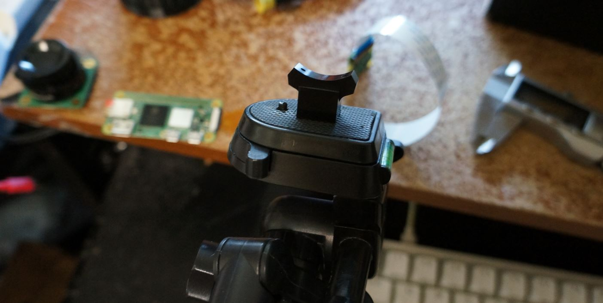

- [x] design lock mechanism
- [x] model 2.4" LCD screen
- [ ] verify tripod mount
- [ ] design new body
- [ ] solder electronics/measure against body before printing
- [ ] print body/assemble
- [ ] design and print lens wrappers for 16mm 10MP lens
- [ ] consolidate/update camera software as Pelicam

### 03/11/2024

10:59 AM

Yeap... definitely came down with something, thinking a cold

Sucks... WHYYYYYY on my days off to do a project

I can still power through, I just had miserable sleep last night

It's actually good that it's on my days off because I am low on UPT it's called and I'll get fired if I take any days off damn.

Can apply for medical leave but need a legit doctors note and whatever

That's the brutal thing, this is the 3rd time I've gotten sick now from work... so many people, shared spaces

12:27 PM

Slow start today

The biggest thing I need to get done is design the camera so I can print then do other work in the background

12:43 PM

Still distracted, starting to print the tripod insert/surrounding material though

12:59 PM

First print is too tight, trying again, it should be tightish but can be taken out, glue seals it in place

1:55 PM

Alright design time, I have like up to 5 hours before I gotta leave

---

### 03/10/2024

2:29 PM

I took today off but damn I slept way too long. The clock did move an hour forward.

I woke up at 2PM, not sure what time I slept... normally I'm up by 5:55 AM to get ready for the factory work

I'm still waiting for some parts, the 10MP lens in particular and then some more filament

I'm going to design the sliding mount thing today and start designing the camera around that big display

I want to put an IMU in the camera... was also thinking a speaker but the Pi Zero doesn't have an aux cable

Which I've done a GPIO hack before from a tutorial to get sound out, but it's not really worth it... other than shutter sound

The IMU is similar... like a horizon line is cool but not really much more than that

Other versions I guess, new body or something

I want to get this camera done by end of 3/13/2024 also

What I'm concerned about right now is the type-a cables are kind of long so the height of the sliding thing and length will have to be sizeable

Ooh... immediate fail... the camera will be rotated if they're mounted sideways

I'm burning a new bookworm rpi image to the 128GB gold sadisk micro sd card... ugh... I initially was going to buy 64GB but the 128GB was $1 more lol crazy

I'm fighting the feeling of "tihs project is pointless, you are poor" right now

Escape from reality

I want to actually use this camera and it's spring time now so the redbuds here in Kansas will come out, those are super pretty

I really hope I'm not sick too, I was crammed in a room of like 50 people the other day to do some training and people were coughing/sneezing

2:50 PM

This will work

It's not that high and the cable isn't crushed

The 15-pin bridge does not have any mounting holes so I'll have to come up with a snap in clip for it

It could also just be glued down... hot glue yeah... I don't want to spend much time being fancy

A channel that it sits in then glued down would work, hot glue so it can be undone

2:54 PM

Hehe... a new RPi enters the local network, 234

Damn this is long

Quick break

3:28 PM

Back on

3:54 PM

oh man! I just realized something... the RPi HQ cam comes with a tripod mount... duh...

So you can use that instead of the bolts...

I'll do that because I think most people if anybody reproduces this project will go with an RPi HQ cam vs. the modules/other subpar cameras resolution wise

At some point will include an alternate design for the nut

The nut is 1/4-20 inch

3:57 PM

I'm designing the sliding plates now

3:59 PM

My man... I forgot I modeled the RPi HQ Cam for the pi zero hq cam project

Yeah... the boards are definitely not the same size lmao (v2 vs. hq)

4:12 PM

I'm struggling with this lock mechanism

The cable goes into the pi body at the top, bottom one is folded into an S shape and compressed

The camera is attached to a staple shaped thing eg. n which slides over this and locks against the base plate (height)

4:30 PM

Ehh... I don't feel great with this locking system, kind of lazy

Gonna just start printing and testing physically

This is such a small piece of what I have to do, so much to do

4:37 PM

Oh yeah today I'll fire up the display with the Pelicam logo, sell myself the vision

4:45 PM

print started

man my sleep pattern is gonna be mega f'd but my day job I can just take a 5hr energy and it's pretty much a paid workout, I hit 230 lbs today, in my remote days my highest weight I think was like 269 lbs or something crazy like that

Alright let's keep moving... NOS opened...

Modeling the display, I'm removing the brass stand offs

OMG this display is so nice... a legit display, not a tiny one

Hmm looking it up says bright mode is better in daylight... I'll try it

All of my menus so far have been dark mode

Why does my cat feel compelled to chew on things, he's chewing on an anti-static discharge bag

4:53 PM

Omg... ytf is VCC purple

4:55 PM

I forgot about the list of things to do

- [ ] design lock mechanism
- [x] model 2.4" LCD screen
- [ ] design new body
- [ ] solder electronics/measure against body before printing
- [ ] print body/assemble
- [ ] design and print lens wrappers for 16mm 10MP lens
- [ ] consolidate/update camera software as Pelicam

Sadly wednesday is a rainy day... may still go out

Going to skip the plasma donos, sucks but the price goes down, got a 3mo since started bonus, not much but can make up that lost money, it's dumb like I spent that much anyway on all these random parts

I have 2 HQ modules now they're `$50` each, the 16MP lens is `$50`

Oh well... so it goes

5:16 PM

Alright model done, basic for major dimensions

5:17 PM

Guess I'll do some soldering, need to get a 40 pin header on the RPi zero 2

5:34 PM

Damn... I just soldered the wrong thing on (female header on RPi)... great

I can test the display on a Pi Zero 1

I say "wrong" because the 2.4" LCD has female pins so needs male header... oh well

5:52 PM

Huh... looks like it's portrait? hmm, the test image is portrait anyway

yeah the dimensions lead with 240 vs. 320 for the 240x320 resolution hmm

Well it looks good

6:04 PM

Whoops... this is completely wrong ha... the 15pin area is nice and snug, slides right in

Forgot about the gap for the sliding bit

At least I only have to print the top part

6:18 PM

Print #2...

6:29 PM

Lol... I'm tracing this tripod mount thing from RPi

It's not exact but as long as I can mount it to the camera body... another test print

6:36 PM

Not sure if I'm making good progress or what...

There is still a lot to do, tomorrow I gotta run around and pick things up/ship something so that's some distraction

6:53 PM

It kinda sucks the buttons are set in place by the proto board but it's nice regarding that it already exists/easy to solder onto

The pi zero hq cam's d-pad board may be good enough for the design... may adjust the back button position

6:58 PM

I'm trying to move the back button up/match the design

THe sliding camera lock screws up this design too (the battery bump) since it is tall... was envisioning it to be sideways but that would rotate the images which are not square/intended to be landscape

I'll start the dimensions/design around the display and then use the volume of things to make the general size of the camera

Still need to lock in the lock design

7:09 PM

I'm losing momentum, I'm holding the parts in hand against existing and trying to come up with a design

The side profile is possible with how tall the sliding mount is

Next month will be rough, I'll be short on money again damn

Applying to jobs has not been going well so far, no responses

7:16 PM

Damn... I'm running out of steam

Need to get more done today, something from the list

I may not get the printing done for the new lens since that takes a while, each part is like 3-5 hrs

7:22 PM

Gonna take a break, damn... lost momentum ugh...

9:07 PM

This is looking good, this is how the camera would sit, custom plates per camera but yeah

9:41 PM

Oh no... I think I am coming down with something... whyyyyyyy

WHYYYYYYY?!!!!

I will finish this project

9:51 PM

time marches on... soon the exciting thing will be the past
