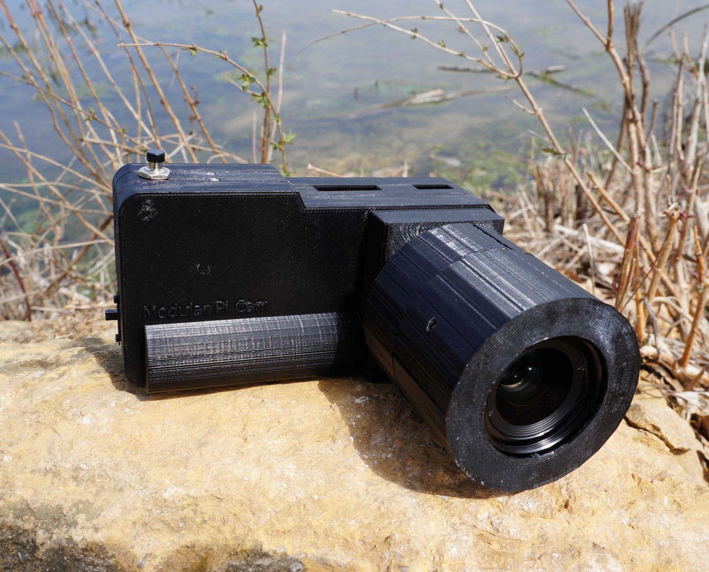
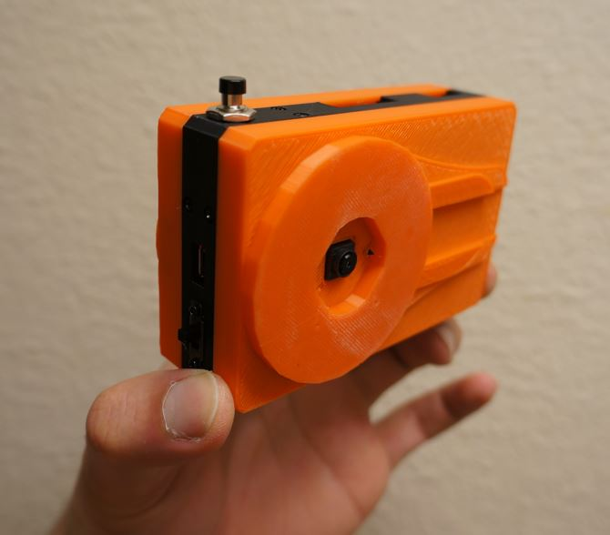

### Modular Pi Cam

### Ver 2 (2.4in rectangle display)

### Ver 1 (1.28 round display)

This version uses round display (non-touch) with 5D joystick

### Modularity

The center piece has changeable back and front plates