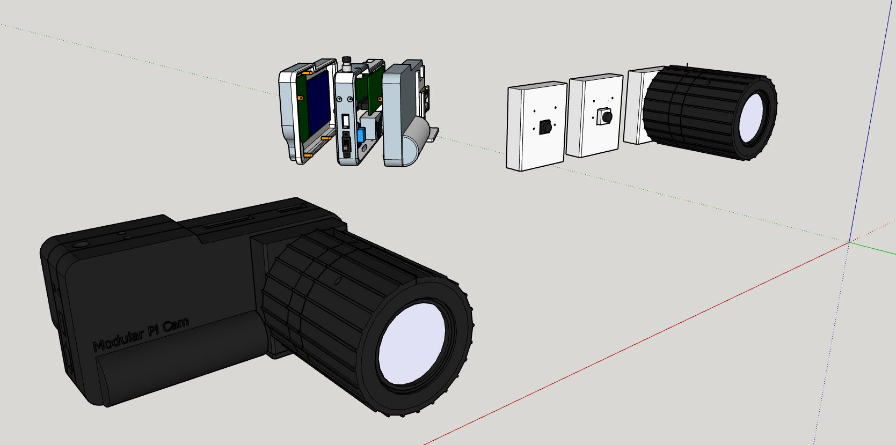

### Print times

PLA 1.75mm 20% infill with supports, 50 mm/s

- camera body
  - 8hrs 47min - front plate (upside down, recommended)
  - 9hrs 37min - front plate
  - 3hrs 5min - middle plate
  - 4hrs 13min - back plate

- camera module mounts
  - 1hr 26min - v2 8MP (plain design)
  - 1hr 13min - HQ cam (plain design)
  - 1hr 25min - v3 (plain design)

- 16mm telephoto lens wrappers
  - 5hr 47min - focus ring
  - 3hr 8min - aperture ring
