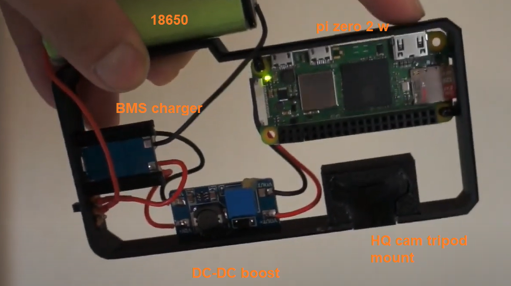
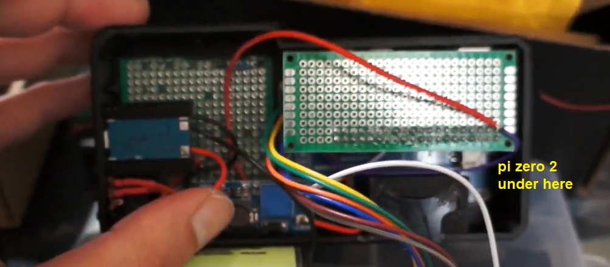

### Parts list

- raspberry pi zero 2 w
  - https://www.pishop.us/product/raspberry-pi-zero-2-w/
- raspberry pi hq cam
  - https://www.adafruit.com/product/4561
- 16mm telephoto lens
  - https://www.adafruit.com/product/4562
- DC-DC boost converter
  - [very long link](https://www.amazon.com/Converter-Adjustable-Voltage-Regulator-Compatible/dp/B089JYBF25/ref=sr_1_3?crid=2RFLMR0KISMA&dib=eyJ2IjoiMSJ9.OVkOHemqP_yF8PlJmBNcom_j4QG2oRNpZ61k_IOb9Xm5c3ObAhy5qs_ufrKQpdvA_WCCoQkBfXneCTssI7zzJ8KLwTk7C-VCNBqaKlRvmz0qstVRJQPuKTFQ4fnQmfKPgu2LKo7XrnijwzpMjglif81B69G421nmjTUhkVVPj7aTAC-x2vec-1lcoc1x6HBgZHygBCZV78U91Tq8DX356CyUN-c9bx3S34zPXcbokBU.IkknOGvjZJnIZAW7PvTu5leq2PeJty-C4CsCXDZJptM&dib_tag=se&keywords=dc+dc+boost+converter&qid=1717450650&sprefix=dc+dc+boost+converte%2Caps%2C102&sr=8-3)
- 18650 battery
  - https://www.18650batterystore.com/products/panasonic-ncr18650b
- waveshare 2.4" LCD display
  - https://www.waveshare.com/2.4inch-lcd-module.htm
- tactile button
  - https://www.amazon.com/gp/product/B07VSNN9S2/ref=ppx_yo_dt_b_search_asin_title?ie=UTF8&psc=1
- shutter button
  - https://www.amazon.com/gp/product/B09DJY5Y5L/ref=ppx_yo_dt_b_search_asin_title?ie=UTF8&psc=1
- 1 cell BMS/charger
  - https://www.amazon.com/gp/product/B00LTQU2RK/ref=ppx_yo_dt_b_search_asin_title?ie=UTF8&psc=1
- proto PCB board (cut to size)
  - https://www.amazon.com/gp/product/B072Z7Y19F/ref=ppx_yo_dt_b_search_asin_title?ie=UTF8&psc=1
- soft wire
  - https://www.amazon.com/gp/product/B01LH1G2IE/ref=ppx_yo_dt_b_search_asin_title?ie=UTF8&psc=1

