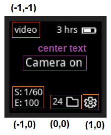
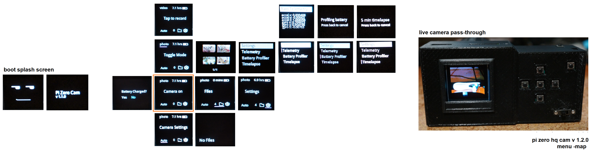

### About

Below you can see the coordinate system

When entering a specific menu subpage/state, the coordinate system is with respect to the active sub menu.

### Menu map

### Functional

- video recording (no time, no live passthrough)
- file counter (file view only does 1 page, images only)
- settings (only has raw telemetry sub-sub page)

### Not Functional

- battery indicator
- auto/manual camera mode eg. shutter/exposure settings
