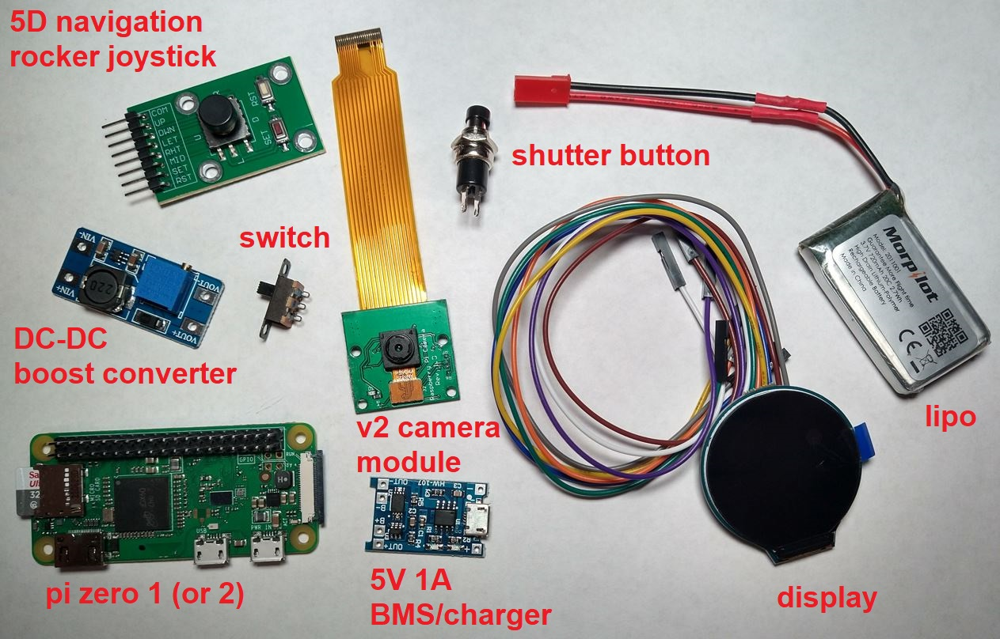
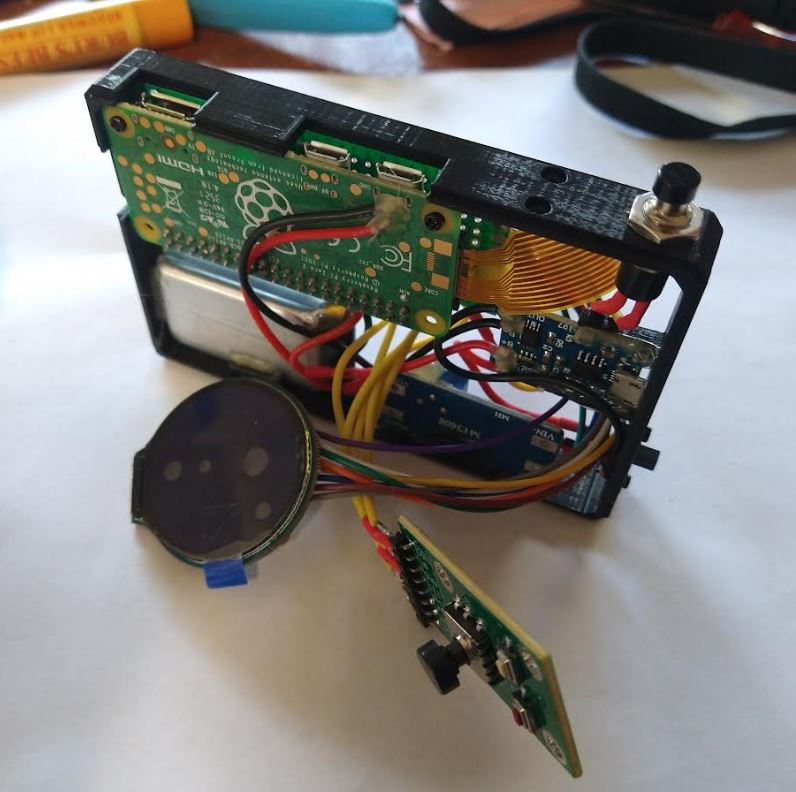
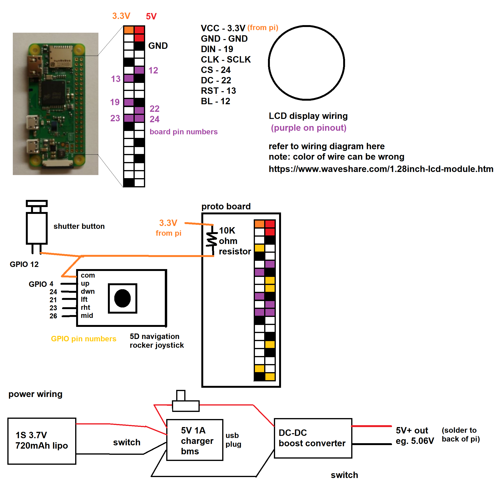

### Electronic components

* $15.00 pi zero w
* $7.99 Navigation Button Module 5D Rocker Joystick
* $0.78 5V 1A charging board
* $0.80 DC DC Boost Converter
* $0.95 battery switch
* $4.00 1S 3.7V Lipo battery
* $19.50 1.28in round LCD IPS module waveshare
* $0.60 SPST momentary spring-return switch
* $19.99 8MP V2 Raspberry Pi camera module

$70.00 camera cost excluding printing material and screws

### Wiring

Sorry this is a pretty lazy one but basic wiring no step down or other sensors

Refer to annotated image above for what each part is

### Disclaimer

This uses a cheap charger/bms that gets very hot. Also the charger is more intended for an 18650 cell (low voltage cutoff) so the software tries to prevent going that low for a pouch-style 3.7V lipo cell that ideally does not go below 3.7V or 3.0V max.
